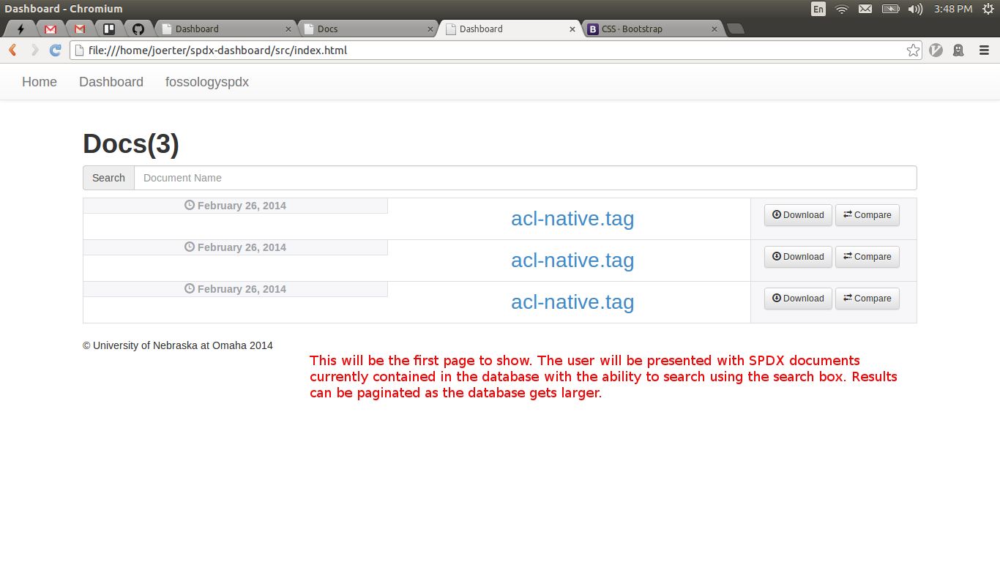
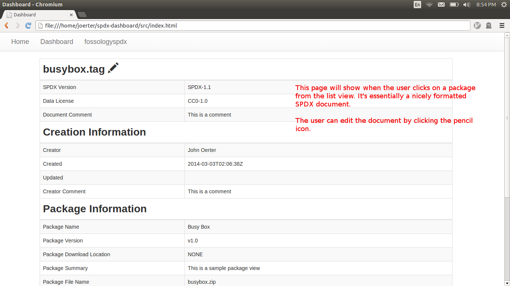
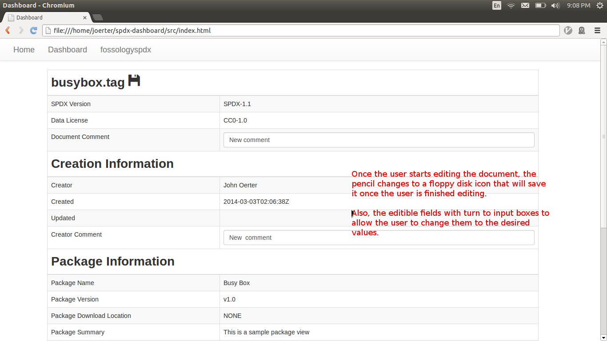
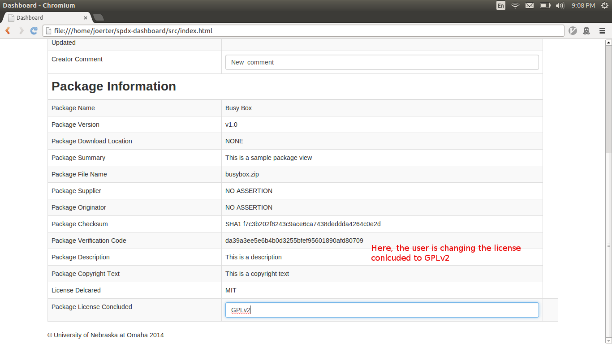
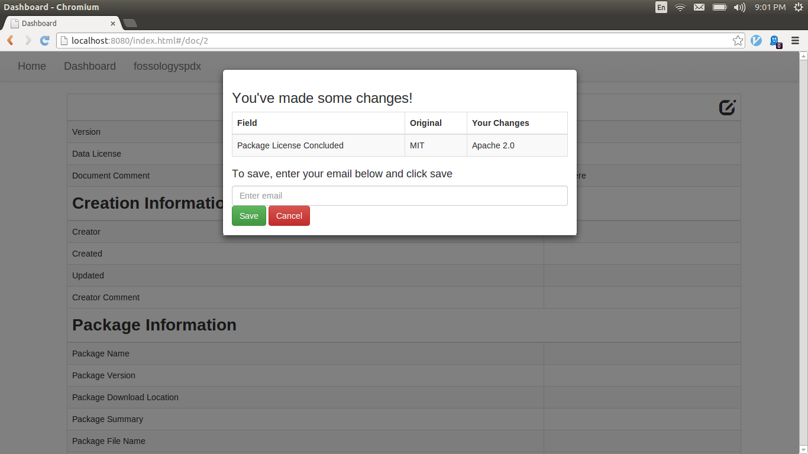
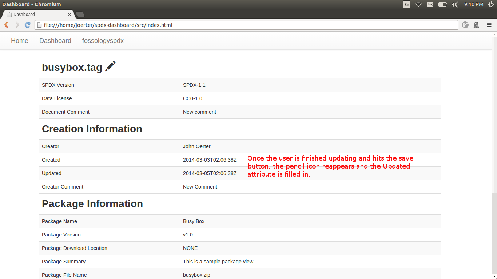

spdx-dashboard
==============

Looking for the SPDX API? It's now located [here](https://github.com/joerter/Database/tree/master/api).

###Overview

The SPDX standard assists organizations in tracking compliance with open source software licenses through the standardization of the method in which license information is shared. An SPDX document communicates the components, licenses, and copyrights associated with a particular software package. More information about SPDX can be found [here](http://spdx.org/about-spdx/what-is-spdx).

The SPDX open source tools is an effort by the University of Nebraska Omaha to support the SPDX community with openly developed tools for integrating SPDX with other efforts such as the FOSSology and Yocto projects. Visit the [SPDX Hub](http://spdxhub.ist.unomaha.edu/) for more information.

The SPDX Dashboard fits into this space by creating a common interface for the upload, retrieval, modification, and sharing of SPDX documents. It will consume SPDX documents created through the [FOSSology+Ninka](https://github.com/ryanv09/ninkology) and [Yocto](https://github.com/chaughawout/Poky/) projects and house an environment to display data from the [Product History Utility](https://github.com/zwmcfarland/ProductHistoryUtility).

The following list describes the main functionality of the completed SPDX Dashboard:
* Listing of SPDX documents currently held in the database.
* Detailed view of  SPDX information corresponding to a single file.
* In-depth view of an SPDX document corresponding to a package.
* Ability to edit an SPDX document at the file level.
* Signoff functionality.
* Integrate with Productization component.
* The SPDX Dashboard will communicate with the database through a RESTful web service.

###Version

Features currently implemented in v1.0  
* Listing of SPDX documents in database repository with search based filtering
* View details of SPDX Doc
* Update Document Comment and Package License Concluded fields

Features not currently implemented, but planned for v1.1 and beyond
* More advanced searching and pagination of SPDX docs contained in the database
* Verification of SPDX doc editors based on email
* Trackable history of updates made to SPDX documents

###License

The Apache 2 License has been chosen with regards to the SPDX Dashboard code. The full license can be downloaded [here](LICENSE).

The Creative Commons has been selected for all documentation. The full license can be viewed [here](http://creativecommons.org/licenses/by/4.0/legalcode).

###Copyright
Copyright (c) 2014 John Oerter, Ajay Medury, Seth Hanson

Licensed under the Apache License, Version 2.0 (the "License");
you may not use this file except in compliance with the License.
You may obtain a copy of the License at

    http://www.apache.org/licenses/LICENSE-2.0

Unless required by applicable law or agreed to in writing, software
distributed under the License is distributed on an "AS IS" BASIS,
WITHOUT WARRANTIES OR CONDITIONS OF ANY KIND, either express or implied.
See the License for the specific language governing permissions and
limitations under the License.

###Technical Specifications

The following is a minimal requirement for the dev environment:
* VIM/Notepad++ for development
* Environment: OS: Ubuntu 12.04,FOSSology: 2.2.0(default configuration),SPDX: 1.1 sepc
* MySQL
* Chrome/Firefox dev tools for debugging values sent between the client and server.
* Postman for API testing
 
###System Design
The image below is the data flow diagram of the SPDX Dashboard 

###Installation
####Prereq
A running instance of the [SPDX API](https://github.com/joerter/Database/tree/master/api).  
The SPDX Dashboard assumes that the api is running on http://localhost:3000, but this can be changed to your server address in the [app.js](https://github.com/joerter/spdx-dashboard/blob/master/src/app.js) file. 

####Deploying the site
The dashboard can be depolyed on your server in any way you choose. If using Apache, simply place the contents of the [src](https://github.com/joerter/spdx-dashboard/blob/master/src/) directory in your document root.

The [web-server.js](https://github.com/joerter/spdx-dashboard/blob/master/src/web-server.js) can be used with node to host the dashboard on localhost:8080. Run with the following:

`node web-server.js`
###Usage

####Editing
 1. Title: document is edited
 2. Primary Actor: Dashboard User
 3. Goal in Context: To update existing information in a SPDX document
 4. Stakeholders and Interests:
	1. User
		1. To alter preexisting data that may be incorrect or outdated.
		2. To include data that may have been previously absent (license assertions)
 5. Preconditions:SPDX document exists as well the need for updated documents
 6. Main Success Scenario:User updates SPDX document information in which the information is stored with full integrity
 7. Failed End Condition:User updates are not stored or are inaccurate 
 8. Trigger: Dashboard user navigates to the update page and clicks the edit button
 9. Notes: See Mockup section for a screen shot of this use case.
 

	
####Signoff
1. Title: User signoff on SPDX document
2. Primary Actor: Authoritative User
3. Goal in Context: To Approve the specifications associated with a SPDX document; especially in the case of license assertions.
4. Stakeholders and Interests:
	1. Dashboard User
		1. To receive approval from authoritative user in generating SPDX documents
	2. Authoritative User 
	 	2. To approve or reject SPDX documents based on license accuracy
5. Preconditions: Dashboard user records SPDX information pertinent to a particular package and submits the information for approval
6. Main Success Scenario:The authoritative user approves Dashboard user's generated SPDX document
7. Failed End Condition:Dashboard user's SDPX document is not approved
8. Trigger:Dashboard user submits 
9. Notes:

####Search/List
1. Title: User searches and lists current SPDX documents 
2. Primary Actor: Dashboard User
3. Goal in Context: To search for and list current SPDX documents stored in the database
4. Stakeholders and Interests:
	1. User
		1. To maintain accuracy and accountability with respect to SPDX documents
5. Preconditions: Data is stored in the database, user has a web browser installed
6. Main Success Scenario:The Dashboard user can list current SPDX documents as well as search for specific SPDX documents
7. Failed End Condition: Dashboard user cannot view the current SDPX docements via the Dashboard
8. Trigger: Dashboard user visits the Dashboard website and clicks on the list/search buttons
9. Notes: See the mockup section for a screen shot of this use case.

####Mockups

###Communities of Interest

1. SPDX 
2. Texas Instruments

###Communication

This will primarily be handeled by email lists such as SPDX-tech and SPDX-legal. Moreover, voip tools such as Skype may be used in the occasion that a virtual meeting is required.

###Code Management

All code sent to the SPDX Dashboard group will be managed through [Pull Requests](https://help.github.com/articles/using-pull-requests) in GitHub.  Following the pull request, the submitted code will be reviewed by all members of the Dashboard team. If the submitted code is accepted, the Dashboard team will pull the code and add it to the SPDX Dashboard repository. Following, the party that submitted the pull request will receive notification that their submission has been accepted.
