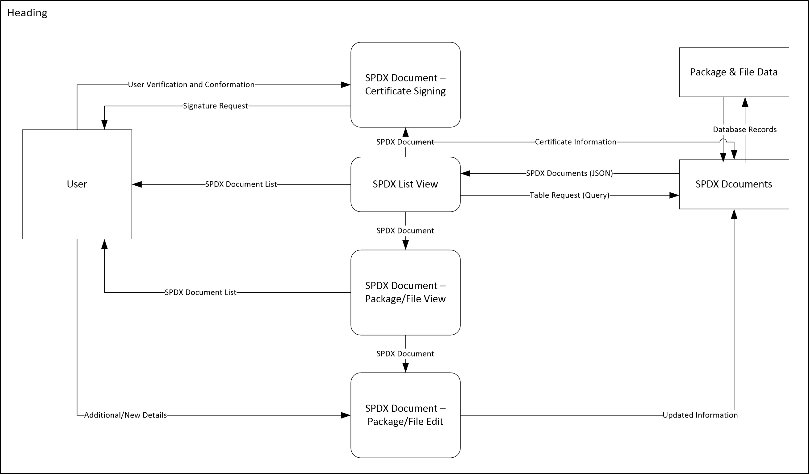

# SPDX Dashboard
## Analysis and Design

### System Charter and Description
The SPDX standard assists organizations in tracking compliance with open source software licenses through the standardization of the method in which license information is shared. An SPDX document communicates the components, licenses, and copyrights associated with a particular software package. More information about SPDX can be found [here](http://spdx.org/about-spdx/what-is-spdx).

The SPDX open source tools is an effort by the University of Nebraska Omaha to support the SPDX community with openly developed tools for integrating SPDX with other efforts such as the FOSSology and Yocto projects. Visit the [SPDX Hub](http://spdxhub.ist.unomaha.edu/) for more information.

The SPDX Dashboard fits into this space by creating a common interface for the upload, retrieval, modification, and sharing of SPDX documents. It will consume SPDX documents created through the [FOSSology+Ninka](https://github.com/ryanv09/ninkology) and [Yocto](https://github.com/chaughawout/Poky/) projects and house an environment to display data from the [Product History Utility](https://github.com/zwmcfarland/ProductHistoryUtility).

The following list describes the main functionality of the completed SPDX Dashboard:
* Listing of SPDX documents currently held in the database.
* Detailed view of  SPDX information corresponding to a single file.
* In-depth view of an SPDX document corresponding to a package.
* Ability to edit an SPDX document at the file level.
* Signoff functionality.
* Integrate with Productization component.
* The SPDX Dashboard will communicate with the database through a RESTful web service.

### System Service Request
The following is a minimal requirement for the dev environment:
* VIM/Notepad++ for development
* Environment: OS: Ubuntu 12.04,FOSSology: 2.2.0(default configuration),SPDX: 1.1 sepc
* MySQL
* Chrome/Firefox dev tools for debugging values sent between the client and server.
* Postman for API testing

### Stakeholders
Currently the stakeholders for this project are:
* Ajay Medury - Contributor
* John Oerter - Contributor
* Seth Hanson - Contributor
* Prof. Matt Germonprez - Guidance
* Liang Cao - Contributor/Guidance
* Jack Manbeck - Community (TI)
* Kate Stewart - Community (SPDX)
* Entire Class to varying degrees associated to their hold of stake ( we will have the largest direct impact on the Airs and Yocto groups)

### Communication Management Plan
The communication management will be handled by the following methods:
* Team Communication - Will proceed primarily using: phone calls, emails, text messages, and also GitHub. The communication will be handled on a day by day basis. With regards to days that the class does not meet; we will coordinate work via GitHub or email. The group will strive to notify all relavent parties of Dashboard updates upon effective completion. Such includes but is not limited to: teams other than our own whom are impacted by our performance and are collaborating with, the professor (Matt Germonprez), Liang and any other parties in close correlation to our work. The preceding is based only where applicable with no guarantees with regards to precise swiftness of communication. The Dashboard team will do everything in their power to produce an environment that enables community betterment as specified by the SPDX community Such as Kate Stewart and Jack Manbeck.
* Community Communication - The communication here will primarily be handeled by email lists such as SPDX-tech and SPDX-legal. Moreover, voip tools such as Skype may be used in the occasion that a virtual meeting is required.

### Distribution System
The primary distribution system for assignments and any other information will be through GitHub, as it supports ideal collaboration and file sharing mechanisms.

###Code Management
All code sent to the SPDX Dashboard group will be managed through Pull Requests (https://help.github.com/articles/using-pull-requests) in GitHub.  Following the pull request, the submitted code will be reviewed by all members of the Dashboard team. If the submitted code is accepted, the Dashboard team will pull the code and add it to the SPDX Dashboard repository. Following, the party that submitted the pull request will receive notification that their submission has been accepted.

### Use Cases
####Editing
 1. Title: document is edited
 2. Primary Actor: Dashboard User
 3. Goal in Context: To update existing information in a SPDX document
 4. Stakeholders and Interests:
	1. User
		1. To alter preexisting data that may be incorrect or outdated.
		2. To include data that may have been previously absent (license assertions)
 5. Preconditions:SPDX document exists as well the need for updated documents
 6. Main Success Scenario:User updates SPDX document information in which the information is stored with full integrity
 7. Failed End Condition:User updates are not stored or are inaccurate 
 8. Trigger: Dashboard user navigates to the update page and clicks the edit button
 9. Notes: See Mockup section for a screen shot of this use case.
 

	
####Signoff
1. Title: User signoff on SPDX document
2. Primary Actor: Authoritative User
3. Goal in Context: To Approve the specifications associated with a SPDX document; especially in the case of license assertions.
4. Stakeholders and Interests:
	1. Dashboard User
		1. To receive approval from authoritative user in generating SPDX documents
	2. Authoritative User 
	 	2. To approve or reject SPDX documents based on license accuracy
5. Preconditions: Dashboard user records SPDX information pertinent to a particular package and submits the information for approval
6. Main Success Scenario:The authoritative user approves Dashboard user's generated SPDX document
7. Failed End Condition:Dashboard user's SDPX document is not approved
8. Trigger:Dashboard user submits 
9. Notes:

####Search/List
1. Title: User searches and lists current SPDX documents 
2. Primary Actor: Dashboard User
3. Goal in Context: To search for and list current SPDX documents stored in the database
4. Stakeholders and Interests:
	1. User
		1. To maintain accuracy and accountability with respect to SPDX documents
5. Preconditions: Data is stored in the database, user has a web browser installed
6. Main Success Scenario:The Dashboard user can list current SPDX documents as well as search for specific SPDX documents
7. Failed End Condition: Dashboard user cannot view the current SDPX docements via the Dashboard
8. Trigger: Dashboard user visits the Dashboard website and clicks on the list/search buttons
9. Notes: See the mockup section for a screen shot of this use case.

### Data Flow Diagram
The image below is the data flow diagram of the SPDX Dashboard 

### Database 
The current database schema can be downloaded [here](db_schema.html).
#### Data Access
The Dashboard requires a RESTful API to communicate with the database. This is currently under development, and the following methods have been implemented:
GET api/spdx_docs // Returns all spdx docs in the database
GET api/spdx_docs/id // Returns the spdx doc with the given id

GET api/creators // Returns all spdx docs in the database
GET api/spdx_docs/id // Returns the spdx doc with the given id

GET api/spdx_docs // Returns all spdx docs in the database
GET api/spdx_docs/id // Returns the spdx doc with the given id

GET api/spdx_docs // Returns all spdx docs in the database
GET api/spdx_docs/id // Returns the spdx doc with the given id

GET api/spdx_docs // Returns all spdx docs in the database
GET api/spdx_docs/id // Returns the spdx doc with the given id

### License Choice
The MIT License has been chosen with regards to the SPDX Dashboard. The full license can be downloaded [here](../LICENSE).

### Change Log
|Version | Date    | Comments                             |
|--------|---------|--------------------------------------|
|v0.1    |2/26/2014|Copied over the existing information from the previous A&D document|
|v0.2	 |2/26/2014|Added new DFD according to new specifications|
|v0.5	 |3/2/2014 |Added use cases. Updated System charter
