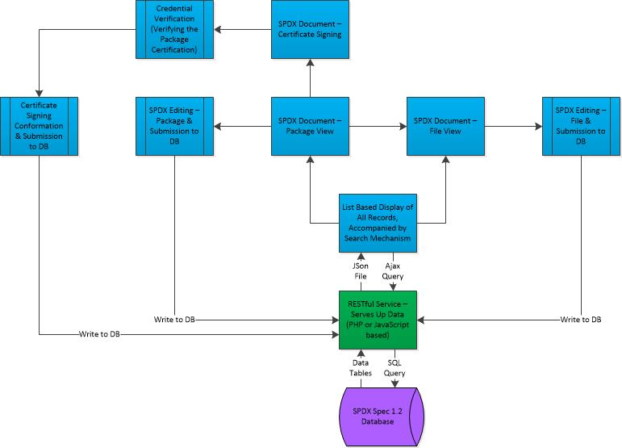

# SPDX Dashboard
## Analysis and Design

### System Charter and Description
The SPDX standard assists organizations in tracking compliance with open source software licenses through the standardization of the method in which license information is shared. An SPDX document communicates the components, licenses, and copyrights associated with a particular software package. Although this standard produces a streamlined avenue for organizations to comply with software licenses, it is still challenging to derive a plethora of SPDX documents. The SPDX Dashboard addresses this issue by creating a common interface for the: upload, retrieval, modification, and sharing of SPDX documents.

The following list describes the main functionality of the completed SPDX Dashboard:
* Listing of SPDX documents currently held in the database.
* Detailed view of an SPDX document corresponding to a single file.
* In-depth view of an SPDX document corresponding to a package.
* Ability to edit an SPDX document.
* Signoff functionality.

The SPDX Dashboard will communicate with the database through a RESTful web service.

### System Service Request
The following is a minimal requirement for the dev environment:
* An IDE that is capable of editing and debugging JavaScript code.
* A server software that can host the database and any services, locally on the developers' machine.
* A database explorer to browse and edit database fields when required.
* A debugging tool to validate if particular values are being sent to the client from the server.

### Stakeholders
Currently the stakeholders for this project are:
* Ajay Medury - Contributor
* John Oerter - Contributor
* Seth Hanson - Contributor
* Prof. Matt Germonprez - Guidance
* Liang Cao - Contributor/Guidance
* Jack Hanneman - Community (TI)
* Kate Stewart - Community (SPDX)
* Entire Class with various weights associated to their hold of stake ( we will have the largest direct impact on the Airs and Yocto groups)

### Communication Management Plan
The communication management will be handled by the following methods:
* Team Communication - Will proceed primarily using: phone calls, emails, text messages, and also GitHub. The communication will be handled on a day by day basis. With regards to days that the class does not rendezvous; we will co-ordinate work via GitHub or email. The group will strive to communicate all time sensitive material to all relavent parties upon effective completion. Such includes but is not limited to: teams other than our own whom are impacted by our performance and are collaborating with, the professor (Matt Germonprez), Liang and any other parties in close correlation to our work. The preceding is based only where applicable with no guarantees with regards to precise swiftness of communication. The Dashboard team will do everything in their power to produce an environment that enables community betterment.
* Community Communication - The communication here will primarily be handeled by email, and potentially via voip tools such as Skype in the occasion that virtual meeting is required.

### Distribution System
The primary distribution system for assignments and any other information will be through GitHub, as it supports ideal collaboration and file sharing mechanisms.

##Code Management
All code sent to the SPDX Dashboard group will be managed through Pull Requests (https://help.github.com/articles/using-pull-requests) in GitHub.  Following the pull request, the submitted code will be reviewed by all members of the Dashboard team. If the submitted code is accepted, the Dashboard team will pull the code and add it to the SPDX Dashboard repository. (Will we notify peeps if it has been accepted?)

## Use Cases
###Editing
* 1.Title : document is edited
* 2. Primary Actor: Dashboard User
* 3. Goal in Context:  To update existing information in a SPDX document
* 4. Stakeholders and Interests:
	1. User
		To alter preexisting data that may be incorrect or outdated.
		To include data that may have been previously absent (license assertions).
* 5. Preconditions:
* 6. Main Success Scenario:
* 7. Failed End Condition:
* 8: Trigger:
* 9:Notes:
	
###Signoff
* 1.Title: User signoff on SPDX document
* 2. Primary Actor: Authoritative User
* 3. Goal in Context: To Approve the specifications associated with a SPDX document; especially in the case of license assertions.
* 4. Stakeholders and Interests:
	1. User
		To maintain accuracy and accountability with respect to SPDX documents.

###Installation
*1.Title

### Data Flow Diagram
The image below is the data flow diagram of the SPDX Dashboard 

### Database 
The current database schema can be downloaded [here](schema.html).

### License Choice
The MIT License has been chosen as quintessential with regards to the SPDX Dashboard. The full license can be downloaded [here](../LICENSE).

### Change Log
|Version | Date    | Comments                             |
|--------|---------|--------------------------------------|
|v0.1    |2/1/2014 |Initial rough draft with placeholders |
|v1.0    |2/4/2014 |Final draft for Assignment 1          |
